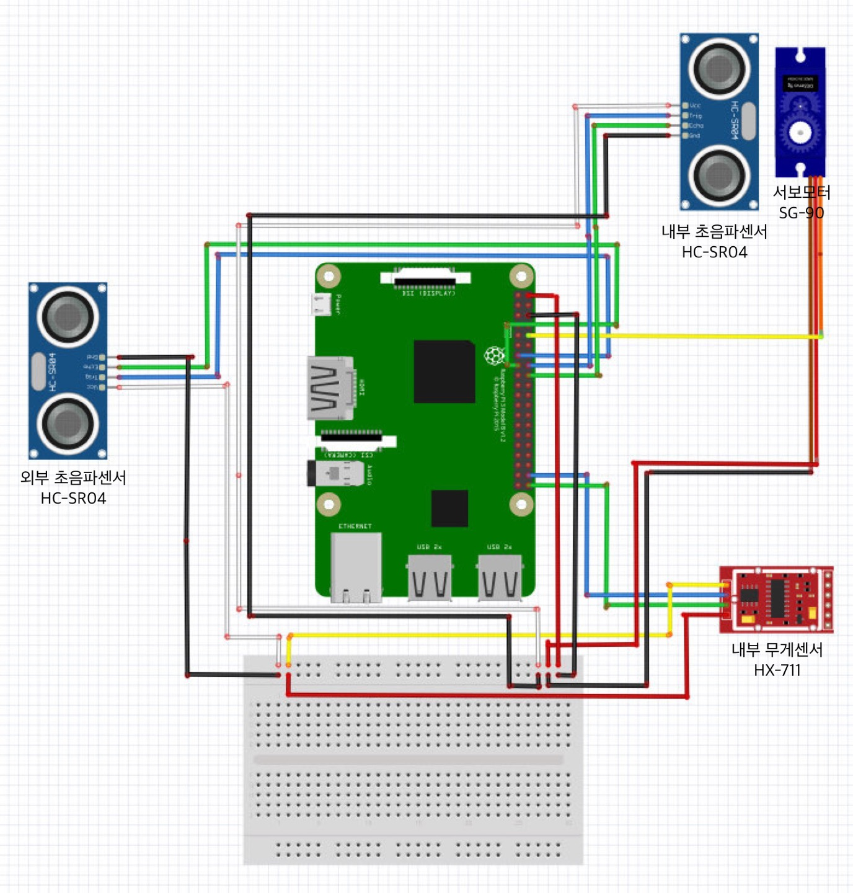
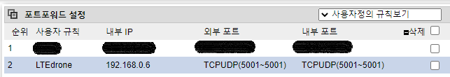
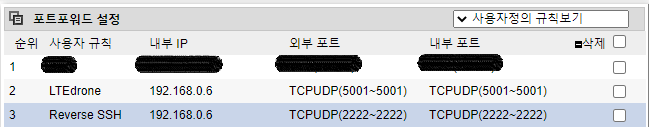
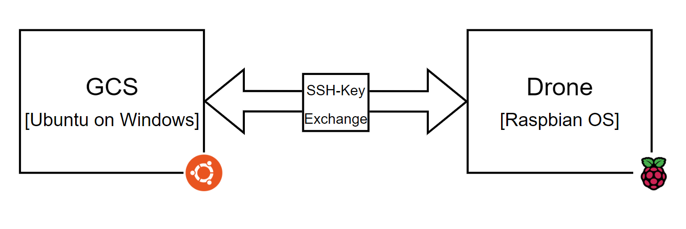

# Smart Trash Can data collection system for Drone
드론의 스마트 쓰레기통 데이터 수집 시스템<br>
- **Team** : DoD<br>
- **Contributors** : 조우형, 김준영, 박중후, 유예린<br>
## 💡 Summary
>요즘 코로나로 인한 일회용품 사용이 많아지는 등 쓰레기 배출이 많아지고, 쓰레기통이 넘칠 때까지 쓰레기를 버려 쓰레기통 주변이 더러워지는 사례가 많이 발생한다.<br><br>
>이에 따라, 자주 쓰레기통을 비워야 하는 어려움이 있다.<br><br>
>수시로 쓰레기통을 확인하러 다니기엔 인력과 시간 소모가 많아지면서 이를 해결할 수 있는 방안으로 스마트 쓰레기통을 제작하고 드론이라는 수단을 활용하고자 한다.<br><br>
>드론을 활용하여 스마트 쓰레기통의 데이터를 주고받는 통신을 하여 쓰레기통에 있는 쓰레기의 양을 확인하고자 한다.<br><br>
>수집한 데이터의 값으로 쓰레기의 양을 측정하고 측정된 값으로 쓰레기를 효율적으로 수거하는 IoT 시스템을 구축할 수 있다는 기대효과를 가지고 이 프로젝트를 선정하였다.

## 🗑 Smart Trash Can
- **Spec**
  - **Hardware** - Raspberry Pi 4 8GB
  - **OS** - Raspbian OS
  - **Sensor 1** - 초음파 센서 HC-SR04
  - **Sensor 2** - 무게 센서 HX-711
  - **Sensor 3** - 서보 모터 SG-90

- **Schematic**
<p align="center">
  
</p>

- **Progress**
<br>

- [ ] 알고리즘 도표<br>
- [ ] 작동 자료<br>

## 🚁 Drone
- **Spec**
  - **FC** - AutoPilot Pixhawk 4
  - **Server** - Raspberry Pi 3 B+
  - **Server OS** - Linux-5.10.103 with debian-10.12
  - **LTE Module** - SixFab EG25-G (Global)
  - **GCS OS** - Ubuntu 18.04.5 on Windows

- **Architecture**
<p align="center">
  
</p><br>


- **Progress**
> ✔ **LTE Module 부착**
<br>

<br><br>
1. LTE Module 및 안테나 연결<br><br>
2. Sixfab 모듈 펌웨어 설치<br><br>
3. eth0, wlan0 해제 후 셀룰러 모드 동작 확인<br><br>
<br clear="left"/><br>

***
> ✔ **MAVProxy로 FC 통신하는 GCS 설정**
<br>
<p align="center">
  
</p>
<div align=center>1. 5001 포트포워딩 설정</div><br>
<div align=center>2. 드론은 5001 포트를 통해 GCS와 통신한다.</div><br><br>

```
pi@drone:~ $ sudo apt update
pi@drone:~ $ sudo apt upgrade
pi@drone:~ $ sudo pip install future pyserial dronekit MAVProxy
pi@drone:~ $ sudo apt install screen python-wxgtk4.0 python-lxml
```
```
pi@drone:~ $ mavproxy.py --master /dev/ttyACM0 --out [routerIP]:5001
```
<p align="center">
  
</p>

<div align=center>MAVProxy를 사용하여 5001포트로 연결한 후 원격으로 드론을 제어하는 모습</div>

***
> ✔ **Reverse SSH 원격 접속**
<br>

```
uhyeong@DESKTOP-R39GAN6:~/.ssh$ sudo vim /etc/ssh/sshd_config
...[생략]...
Port 5001
```
<div align=center>Desktop GCS의 SSH 포트를 5001로 변경</div><br><br>

<p align="center">
  
</p>
<div align=center>1. 2222 포트포워딩 설정</div><br>
<div align=center>2. 2222 포트를 통해 Desktop GCS에 원격 접속</div><br><br>

```
pi@drone:~ $ ssh-keygen -t rsa
```
```
uhyeong@DESKTOP-R39GAN6:~$ ssh-keygen -t rsa
```
<p align="center">
  
</p>

<div align=center>인증된 자동 ssh 로그인을 위한 인증키 생성 및 교환</div><br><br>

```
pi@drone:~ $ sudo ssh -f -N -T -R 2222:localhost:22 uhyeong@[routerIP] -p 5001
```
```
uhyeong@DESKTOP-R39GAN6:~$ ssh pi@localhost -p 2222
```

<div align=center>터널링 후 Reverse SSH 원격 접속</div><br>

```
pi@drone:~/drone/reverse_ssh $ sudo crontab -e
...[생략]...
@reboot sleep 20 && /home/pi/drone/reverse_ssh/reverseSSH.sh
@reboot sleep 30 && /home/pi/drone/reverse_ssh/setIpTable.sh
```

<div align=center>부팅시 자동 터널링 및 라우팅 테이블 갱신</div><br>

***
> ✔ **드론 무선 AP에 스마트 쓰레기통 연결**
<br>

***
> ✔ **드론과 스마트 쓰레기통 TCP 통신**
<br>

## 📌 Next
향후 개발 방향..
