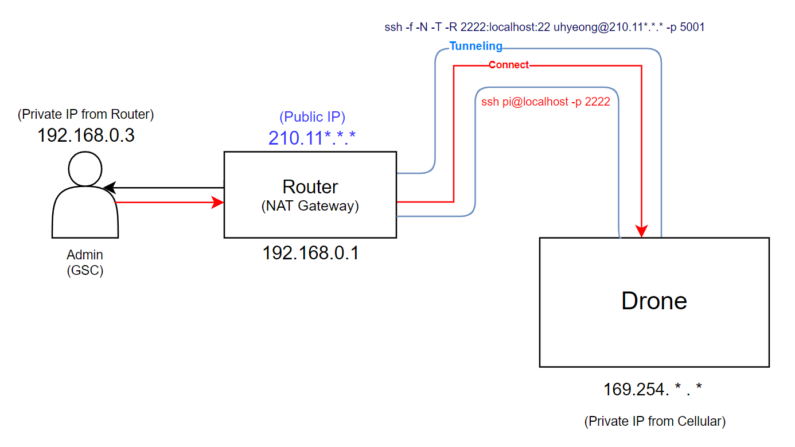

# Smart Trash Data Collection System Based on LTE Drone
LTE 드론 기반 스마트 쓰레기통 데이터 수집 시스템<br>
- **Team** : DoD<br>
- **Contributors** : 조우형, 김준영, 박중후, 유예린<br>
## 💡 Summary
>요즘 코로나로 인한 일회용품 사용이 많아지는 등 쓰레기 배출이 많아지고, 쓰레기통이 넘칠 때까지 쓰레기를 버려 쓰레기통 주변이 더러워지는 사례가 많이 발생한다.<br><br>
>이에 따라, 자주 쓰레기통을 비워야 하는 어려움이 있다.<br><br>
>수시로 쓰레기통을 확인하러 다니기엔 인력과 시간 소모가 많아지면서 이를 해결할 수 있는 방안으로 스마트 쓰레기통을 제작하고 드론이라는 수단을 활용하고자 한다.<br><br>
>드론을 활용하여 스마트 쓰레기통의 데이터를 주고받는 통신을 하여 쓰레기통에 있는 쓰레기의 양을 확인하고자 한다.<br><br>
>수집한 데이터의 값으로 쓰레기의 양을 측정하고 측정된 값으로 쓰레기를 효율적으로 수거하는 IoT 시스템을 구축할 수 있다는 기대효과를 가지고 이 프로젝트를 선정하였다.

## 🗑 Smart Trash Can
- **Spec**
  - **Client Hardware** - Raspberry Pi 4 8GB
  - **Client OS** - Raspbian OS
  - **Sensor 1** - 초음파 센서 HC-SR04 x 2
  - **Sensor 2** - 무게 센서 HX-711
  - **Sensor 3** - 서보 모터 SG-90

- **Schematic**
<p align="center">
  
</p>

- **Progress**
<br>
<p align="center">
  
  
</p>
<br><br>
  
<br><br>
📝 Procedure <br><br>
1. 외부 초음파 센서로 측정된 거리값이 7cm 이하이면 뚜껑이 열림<br><br>
> 서보모터가 뚜껑에 연결된 낚시줄을 잡아 당겨(PULL) 뚜껑이 열림<br><br>
<br>
2. 외부 초음파 센서로 측정된 거리값이 7cm 초과이면 뚜껑이 닫힘<br><br>
> 서보모터가 뚜껑에 연결된 낚시줄이 팽팽한 상태(PUSH) 유지<br><br>
> 뚜껑이 열렸다가 닫힐 시 쉽게 닫히게 하기 위해 무게감있는 물체 설치<br><br>
<br clear="left"/><br>

> ✔ **쓰레기 양 체크 및 무게 측정**
<p align="center">
  
</p><br>


📝 Procedure <br>
1. 무게와 쓰레기통 내부 거리 측정<br>
> 무게 : 무게센서 활용<br>
> 거리 : 쓰레기통 내부 초음파 센서 활용<br>
2. 무게가 500g 이상일 경우
> [Status] : Need change를 출력<br>
3. 쓰레기 찬 정도가 60% 이상일 경우<br>
> [Status] : Need change를 출력<br>
<br clear="left"/><br>

## 🚁 Drone
- **Spec**
  - **FC** - AutoPilot Pixhawk 4
  - **Server** - Raspberry Pi 3 B+
  - **Server OS** - Linux-5.10.103 with debian-10.12
  - **Wireless AP SW Package** - Ardupilot APSync
  - **LTE Module** - SixFab EG25-G (Global)
  - **GCS OS** - Ubuntu 18.04.5 on Windows

- **Architecture**
<p align="center">
  
</p><br>


- **Progress**
> ✔ **LTE Module 부착**
<br>

<br><br>
1. LTE Module 및 안테나 연결<br><br>
2. Sixfab 모듈 펌웨어 설치<br><br>
3. eth0, wlan0 해제 후 셀룰러 모드 동작 확인<br><br>
<br clear="left"/><br>

***
> ✔ **MAVProxy로 FC 통신하는 GCS 설정**
<br>

```
pi@drone:~ $ mavproxy.py --master /dev/ttyACM0 --out [routerIP]:5001
```
<p align="center">
  
</p>

<div align=center>MAVProxy를 사용하여 5001포트로 연결한 후 원격으로 드론을 제어하는 모습</div>

<p align="center">
  
</p>

<div align=center>위 방법으로 드론에 시동 거는 모습</div>

***
> ✔ **Reverse SSH 원격 접속**
<br>

💥 [Trouble Shooting](https://brawny-dingo-fe3.notion.site/reverse-SSH-190c3558907c421b8cd49211976d2777)

<br>

```
pi@drone:~ $ ssh-keygen -t rsa
```
```
uhyeong@DESKTOP-R39GAN6:~$ ssh-keygen -t rsa
```
<p align="center">
  
</p>

<div align=center>인증된 자동 ssh 로그인을 위한 인증키 생성 및 교환</div><br><br>

<p align="center">
  
</p>

```
pi@drone:~ $ sudo ssh -f -N -T -R 2222:localhost:22 uhyeong@[routerIP] -p 5001
```
```
uhyeong@DESKTOP-R39GAN6:~$ ssh pi@localhost -p 2222
```

<p align="center">
  
</p>

<div align=center>터널링 후 Reverse SSH 원격 접속</div><br>

```
pi@drone:~/drone/reverse_ssh $ sudo crontab -e
...[생략]...
@reboot sleep 20 && /home/pi/drone/reverse_ssh/reverseSSH.sh
@reboot sleep 30 && /home/pi/drone/reverse_ssh/setIpTable.sh
```

<div align=center>부팅시 동적 할당 받은 IP 정보로 자동 터널링 및 라우팅 테이블 갱신</div><br>

***
> ✔ **드론 무선 AP에 스마트 쓰레기통 연결**
<br>
<p align="center">
  
</p>
<div align=center>오픈소스 ArduPilot APSync 소프트웨어 패키지를 활용하여 드론의 무선 AP 활성화</div>

<br>

<p align="center">
  
</p>

<div align=center>스마트 쓰레기통이 드론 무선 AP에 연결한 모습</div>

***
> ✔ **드론과 스마트 쓰레기통 TCP 통신**
<br>
<p align="center">
  
  
  
</p>

<div align=center>무선 상태의 드론 (왼쪽) / 스마트 쓰레기통 데이터 측정 (가운데) / GCS에서 드론에 원격 접속 및 데이터 수신 (오른쪽)</div>

<br>

<p align="center">
  
  
</p>

<div align=center>server.py (왼쪽) / client.py (오른쪽) / TCP 통신으로 데이터 송수신 구현</div>

## 📌 Next
> * 드론이 수신한 스마트 쓰레기통의 데이터 값을 웹 또는 어플리케이션으로 구현 <br>
> * 스마트 쓰레기통에 GPS 센서를 부착하여 지도 상에 여러 스마트 쓰레기통의 상태 표시 <br>
> * 드론에 자율 비행을 구현하여 스마트 쓰레기통의 GPS 데이터를 이용하여 위치에 도달
> * 스마트 쓰레기통이 아닌 여러 IoT기기를 제작하여 스마트시티 시스템 도달
